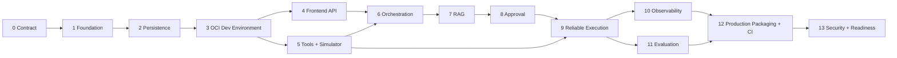

# TravelOps AI Worker — Backend and Platform Delivery Roadmap

Status: Planning contract. No backend implementation is authorized by this document alone.

## 1. Executive summary

The existing frontend is a validated presentation layer. The next objective is not to reproduce all
frontend fixtures in Python at once. It is to build one executable refund vertical slice while
preserving the safety semantics already demonstrated:

```text
task
→ context
→ policy evidence
→ proposal
→ approval
→ idempotent execution
→ postcondition verification
→ reconciliation when uncertain
→ audit and evaluation
```

The recommended architecture is a modular monolith:

```text
backend/app
├── api
├── domain
├── services
├── orchestration
├── retrieval
├── tools
├── persistence
└── observability
```

FastAPI serves the API. PostgreSQL is the source of durable business state. LangGraph coordinates
explicit workflow transitions. Redis carries background execution work but does not become the
source of truth. The provider simulator supplies deterministic external behavior. The frontend
integrates through versioned API contracts. OCI-compatible Containerfiles and Compose Specification
are used from early development; Docker Compose is the verified local command and Podman remains an
OCI compatibility target.

The first credible vertical slice ends after Sprint 9. At that point a refund task can move from
ingestion through evidence-backed proposal, approval, provider execution, postcondition verification,
and uncertain-outcome reconciliation using persisted state.

## 2. Delivery rules

1. One repository and one modular backend application.
2. PostgreSQL owns durable state; Redis is replaceable infrastructure.
3. No model may authorize an action or bypass deterministic risk rules.
4. No “completed” state before external postcondition verification.
5. No blind retry when an external side effect may exist.
6. Frontend integration begins before the complete agent workflow exists.
7. Every sprint ends with executable acceptance evidence.
8. A later sprint may change an earlier contract only through migration and compatibility review.
9. Production claims require generated evidence, not fixture text.
10. Do not start the next sprint before engineering review, design/operational QA, and human approval.

### Initial non-functional design envelope

These are sizing and test assumptions for architecture decisions, not production-SLA claims:

- Up to 50 concurrent operators and 1,000 refund tasks per day.
- Up to 200 active policy documents and 10,000 indexed policy chunks in the first deployment profile.
- Read APIs target p95 below 500 ms and non-execution mutation APIs below 750 ms on the documented
  reference environment.
- Warm filtered retrieval targets p95 below 300 ms, measured separately from model generation.
- Provider/model work is asynchronous when it cannot reliably complete inside the API budget.
- Acknowledged work survives API/worker restart; externally uncertain writes are reconciled rather
  than blindly retried.
- Every consequential transition is auditable and recoverable from PostgreSQL-backed state.
- Capacity or latency beyond this envelope requires measurement before adding brokers, replicas,
  distributed caches, or microservices.

Each relevant sprint must record the test environment and observed result. Missing measurement means
“not yet proven,” not a silent pass.

## 3. Recommended sprint sequence

| Sprint | Name | Primary outcome |
|---:|---|---|
| 0 | Delivery contract | Frozen boundaries, commands, and acceptance scenarios |
| 1 | Backend foundation | Runnable FastAPI service with configuration and health |
| 2 | Core domain persistence | Tasks and runs survive restart with concurrency control |
| 3 | OCI development environment | Docker Compose starts API, frontend, and PostgreSQL consistently |
| 4 | Frontend API boundary | Existing Inbox and Workspace read backend data |
| 5 | Typed tools and provider simulator | Deterministic booking/refund integrations and failures |
| 6 | Agent orchestration | Durable LangGraph flow reaches a typed proposal |
| 7 | Policy RAG | Versioned pgvector retrieval and cited evidence |
| 8 | Approval governance | Version-bound authorization enforced by backend |
| 9 | Reliable execution | Queue, idempotency, postcondition verification, reconciliation |
| 10 | Audit and observability | Correlated audit, logs, traces, and operational signals |
| 11 | Evaluation and release evidence | Golden cases evaluated against observed runs |
| 12 | Production packaging and CI | Hardened images, CI gates, scans, and smoke test |
| 13 | Security and production-readiness | RBAC, redaction, threat checks, runbooks, release rehearsal |

---

## 4. Sprint-by-sprint breakdown

## Sprint 0 — Delivery contract

### 1. Goal

Freeze the first refund vertical slice, API conventions, state semantics, local commands, and evidence
expected from every later sprint.

### 2. Why this sprint exists

Without a contract, backend work will drift into broad scaffolding and the frontend will be rewritten
against unstable endpoints.

### 3. Exact deliverables

- Backend scope and non-goals.
- Refund acceptance scenarios: completed, failed-no-side-effect, uncertain, stale approval.
- API naming, error envelope, correlation ID, version-field, and timestamp conventions.
- Python, package-manager, migration, test, lint, and format commands.
- ADR for modular monolith and PostgreSQL-as-source-of-truth.
- Initial capacity, latency, recoverability, auditability, security, and maintainability assumptions.
- Frontend-to-backend contract migration plan.
- Updated Definition of Ready and review gate.

### 4. Likely files/folders

```text
docs/backend/DELIVERY_CONTRACT.md
docs/adr/000-backend-modular-monolith.md
docs/adr/001-durable-state-and-redis.md
docs/api/CONVENTIONS.md
docs/architecture/NON_FUNCTIONAL_REQUIREMENTS.md
backend/README.md
```

### 5. Database/migrations

None.

### 6. API endpoints

Specified only: `/api/health/live`, `/api/health/ready`, `/api/tasks`, `/api/tasks/{id}`.

### 7. Tests required

No product tests. Add a documentation/link validation check only if the repository already supports it.

### 8. QA checklist

- Every state has one meaning.
- “Failed” and “uncertain” remain distinct.
- Frontend field requirements are mapped.
- No requirement silently implies a microservice.
- Capacity and performance numbers are labelled design/test assumptions, not production SLAs.
- Commands work on Windows and CI-oriented Linux shells conceptually.

### 9. Definition of done

The vertical slice and contract are reviewable without guessing endpoint, state, or evidence semantics.

### 10. Explicitly not in this sprint

- No FastAPI scaffolding.
- No database.
- No Docker Compose.
- No LangGraph.

### 11. Risks

Planning can become architecture theater.

### 12. Avoiding overengineering

Limit ADRs to decisions that block Sprint 1–3. Defer model, queue, and telemetry implementation detail.

---

## Sprint 1 — Backend foundation

### 1. Goal

Produce a runnable, testable FastAPI process with strict configuration and health semantics.

### 2. Why this sprint exists

Every later feature needs one stable application entry point and repeatable engineering commands.

### 3. Exact deliverables

- Python project and locked dependencies.
- FastAPI application factory.
- Pydantic settings with environment validation.
- Structured JSON logging baseline and request correlation middleware.
- Liveness and readiness endpoints.
- Standard error envelope.
- Ruff/format, mypy or pyright, and Pytest configuration.
- One-command local start.

### 4. Likely files/folders

```text
backend/pyproject.toml
backend/app/main.py
backend/app/config.py
backend/app/api/errors.py
backend/app/api/middleware.py
backend/app/api/routes/health.py
backend/tests/unit/
backend/tests/contract/
```

### 5. Database/migrations

None. Readiness reports database as `not_configured`, not healthy.

### 6. API endpoints

- `GET /api/health/live`
- `GET /api/health/ready`

### 7. Tests required

- Unit: settings validation and error mapping.
- Contract: health response schemas and correlation header.
- Integration: application boot.

### 8. QA checklist

- Missing required configuration fails fast.
- Secrets are never logged.
- Liveness does not depend on external services.
- Readiness does not claim dependencies are healthy before integration.
- OpenAPI is generated.

### 9. Definition of done

Fresh setup starts the API, health contract tests pass, and invalid configuration produces an explicit
startup failure.

### 10. Explicitly not in this sprint

- No domain entities.
- No ORM base models “for later.”
- No authentication.
- No model SDK.

### 11. Risks

Framework wrappers and generic base classes can consume the sprint without delivering behavior.

### 12. Avoiding overengineering

Use FastAPI and Pydantic directly. Introduce abstractions only when Sprint 2 has a concrete consumer.

---

## Sprint 2 — Core domain persistence

### 1. Goal

Persist the minimum durable business state needed to create a task and track an agent run safely.

### 2. Why this sprint exists

The system cannot be agentic or reliable if task and run state disappears with a process restart.

### 3. Exact deliverables

- PostgreSQL connection and transaction boundary.
- Alembic migrations.
- Domain contracts for Task, Request, AgentRun, and AuditEvent.
- Repository implementations.
- Explicit run-state transition service.
- Optimistic concurrency using integer version fields.
- Seed command for deterministic RF-1042 data.

### 4. Likely files/folders

```text
backend/app/domain/tasks.py
backend/app/domain/runs.py
backend/app/domain/audit.py
backend/app/persistence/models/
backend/app/persistence/repositories/
backend/app/services/task_service.py
backend/app/services/run_service.py
backend/migrations/
backend/scripts/seed_demo.py
```

### 5. Database/migrations

- `tasks`
- `requests`
- `agent_runs`
- `audit_events`

Required columns include IDs, status, version, timestamps, correlation ID, and JSONB only for bounded
typed snapshots—not as a substitute for all modeling.

### 6. API endpoints

Internal service only. Health readiness now checks PostgreSQL connectivity.

### 7. Tests required

- Unit: valid and invalid run transitions.
- Integration: repository CRUD and transaction rollback.
- Concurrency: stale version update returns conflict.
- Migration: upgrade from empty database.
- Restart: persisted state reloads in a new application process/test session.

### 8. QA checklist

- Invalid transition cannot be persisted.
- Audit event is written in the same transaction as state change.
- UTC timestamps only.
- No Redis dependency.
- Seed data is labelled demo.

### 9. Definition of done

A task and run survive restart; stale writes fail deterministically; migration and rollback strategy are
documented.

### 10. Explicitly not in this sprint

- No booking/customer tables.
- No LangGraph.
- No queue.
- No generic event-sourcing platform.

### 11. Risks

Modeling all future entities before workflow usage is known.

### 12. Avoiding overengineering

Create only four persisted aggregates. Add later tables when their services are implemented.

---

## Sprint 3 — OCI development environment

### 1. Goal

Provide one consistent local command that starts the existing frontend, FastAPI backend, and
PostgreSQL on a clean workstation.

### 2. Why this sprint exists

From this point onward, every developer and reviewer should exercise the same environment instead of
manually coordinating Node.js, Python, and PostgreSQL processes. Containerization is introduced here
as a development contract, not as a production-readiness claim.

### 3. Exact deliverables

- OCI-compatible development Containerfiles for frontend and backend.
- `compose.dev.yaml` containing only frontend, API, and PostgreSQL/pgvector.
- Docker Compose as the verified and documented local command.
- Podman portability retained through OCI Containerfiles and the Compose Specification.
- `.env.example` with safe development defaults.
- Named PostgreSQL volume, service healthchecks, and explicit migration/seed commands.
- Source mounts and development reload where they remain reliable.

### 4. Likely files/folders

```text
frontend/Containerfile
backend/Containerfile
compose.dev.yaml
infra/containers/
.env.example
docs/development/CONTAINERS.md
```

### 5. Database/migrations

No new domain schema. Sprint 2 migrations must run against the containerized PostgreSQL service, and
data must survive an ordinary stack restart.

### 6. API endpoints

No new product endpoints. Existing liveness and readiness endpoints are used by service healthchecks.

### 7. Tests required

- Build both application images from a clean cache.
- Validate the Compose configuration and execute it with Docker Compose.
- Container smoke test for frontend, API readiness, migration, and database access.
- Restart test proving persisted task data survives.

### 8. QA checklist

- `docker compose -f compose.dev.yaml up --build` starts all three services.
- The same OCI images and Compose contract remain suitable for later Podman verification.
- No secret is embedded in an image or committed environment file.
- Frontend calls the containerized API through a documented URL.
- Healthchecks represent process and dependency readiness honestly.
- Images use a non-root user where practical without adding fragile permission workarounds.

### 9. Definition of done

A reviewer can follow the fresh-clone instructions and reach the frontend backed by FastAPI and
PostgreSQL through one Docker Compose command. The same OCI/Compose artifacts remain portable to
Podman without making unverified runtime claims.

### 10. Explicitly not in this sprint

- No Redis or worker.
- No provider simulator.
- No LangGraph.
- No CI pipeline.
- No image-size optimization project.
- No reverse proxy, Kubernetes, cloud deployment, or production claim.

### 11. Risks

Container troubleshooting can consume the sprint before the application boundary is stable.

### 12. Avoiding overengineering

Keep exactly three services and one development Compose file. Add infrastructure services only in the
sprint that first uses them.

---

## Sprint 4 — Frontend API boundary

### 1. Goal

Replace Task Inbox and Task Workspace read fixtures with a real backend read path while preserving the
existing UX.

### 2. Why this sprint exists

Early frontend integration exposes contract errors before orchestration and RAG multiply them.

### 3. Exact deliverables

- Task list and task detail endpoints.
- BookingSnapshot and CustomerSnapshot persistence.
- Typed OpenAPI client generation or a small hand-written typed client—choose one, not both.
- Frontend repository adapter selecting API or deterministic fixture mode.
- Pagination, filtering, sorting, and stable error mapping.
- Loading, empty, not-found, error, and degraded states.

### 4. Likely files/folders

```text
backend/app/api/routes/tasks.py
backend/app/domain/context.py
backend/app/services/context_service.py
frontend/src/data/api/
frontend/src/data/tasks/api-task-repository.ts
frontend/src/app/(operations)/tasks/
```

### 5. Database/migrations

- `booking_snapshots`
- `customer_snapshots`
- Foreign keys from task to immutable snapshot versions.

### 6. API endpoints

- `GET /api/tasks`
- `GET /api/tasks/{task_id}`
- Optional demo-only `POST /api/tasks` for controlled ingestion.

### 7. Tests required

- Contract: response schemas consumed by frontend.
- Integration: filters, sorting, pagination, 404, conflict.
- Frontend unit: API adapter mapping.
- Frontend-backend E2E: Inbox → Workspace with real API.

### 8. QA checklist

- Existing URLs remain durable.
- API errors do not masquerade as empty data.
- Demo mode is visibly labelled.
- No frontend authorization claim.
- No direct database access from frontend.

### 9. Definition of done

The existing Inbox and Workspace render persisted backend data without visual regression or fixture
imports in the API mode.

### 10. Explicitly not in this sprint

- No write execution.
- No proposal generation.
- No RAG.
- No WebSocket.

### 11. Risks

Rebuilding the frontend or adding real-time transport before a long-running workflow exists.

### 12. Avoiding overengineering

Use HTTP polling only where needed. Preserve the established frontend repository boundary.

---

## Sprint 5 — Typed tools and provider simulator

### 1. Goal

Create executable, typed travel tools and a deterministic external provider simulator.

### 2. Why this sprint exists

Agent orchestration must call real contracts with controllable failures, not inline mock functions.

### 3. Exact deliverables

- ToolRegistry with Pydantic inputs/outputs.
- Booking, customer, refund-create, and refund-lookup tool adapters.
- Deterministic simulator supporting success, rejection-before-side-effect, timeout-after-acceptance,
  duplicate idempotency key, and delayed postcondition.
- ToolAttempt persistence.
- Redacted audit representation.
- Idempotency contract defined for write tools.

### 4. Likely files/folders

```text
backend/app/tools/contracts.py
backend/app/tools/registry.py
backend/app/tools/booking.py
backend/app/tools/refunds.py
backend/app/integrations/provider_simulator/
backend/tests/contract/tools/
backend/tests/integration/provider_simulator/
```

### 5. Database/migrations

- `tool_attempts`
- `external_receipts`
- Unique constraint for tool name + idempotency key where applicable.

### 6. API endpoints

Simulator-private endpoints may exist under `/simulator/*`; they must not be exposed as product API.

### 7. Tests required

- Unit: Pydantic validation and redaction.
- Contract: each tool input/output.
- Integration: all simulator scenarios.
- Failure: timeout before send versus after acceptance.
- Idempotency: duplicate delivery returns same logical receipt.

### 8. QA checklist

- Tool names use business semantics.
- Secrets/PII are redacted.
- Side-effect state is explicit.
- Simulator scenario is deterministic and selectable by test.
- Model code cannot make arbitrary HTTP calls.

### 9. Definition of done

The backend can execute and persist a refund tool attempt against the simulator and correctly classify
its side-effect knowledge.

### 10. Explicitly not in this sprint

- No LangGraph.
- No model provider.
- No background queue.
- No real airline/refund integration.

### 11. Risks

Building a general integration framework or an unrealistically complex simulator.

### 12. Avoiding overengineering

Implement only four tools and five failure scenarios required by the refund slice.

---

## Sprint 6 — Agent orchestration to proposal

### 1. Goal

Run a durable LangGraph workflow from queued task to a validated, versioned refund proposal.

### 2. Why this sprint exists

This is the first actual agentic backend proof: explicit workflow state, model boundary, and tool use.

### 3. Exact deliverables

- LangGraph state and nodes for classification, context load, preliminary policy lookup interface,
  eligibility, risk, and proposal.
- Provider-neutral ModelGateway.
- Deterministic model adapter for CI and demo reliability.
- One optional real LLM adapter behind configuration, not required for default tests.
- Structured prompts and Pydantic outputs.
- ProposalVersion and RiskDecision persistence.
- Graph checkpoint strategy backed by PostgreSQL-compatible persistence.
- Run endpoint starts/resumes the graph.

### 4. Likely files/folders

```text
backend/app/orchestration/state.py
backend/app/orchestration/refund_graph.py
backend/app/orchestration/nodes/
backend/app/models/gateway.py
backend/app/models/deterministic.py
backend/app/models/providers/
backend/app/prompts/
backend/app/domain/proposals.py
```

### 5. Database/migrations

- `risk_decisions`
- `proposal_versions`
- LangGraph checkpoint tables if required by selected persistence adapter.
- Model/prompt/graph version fields on run or proposal.

### 6. API endpoints

- `POST /api/tasks/{task_id}/agent-runs`
- `GET /api/agent-runs/{run_id}`
- `GET /api/tasks/{task_id}/proposals/{version}`

### 7. Tests required

- Unit: node input/output and deterministic risk rules.
- Workflow: allowed transitions and checkpoint resume.
- Contract: model gateway structured output.
- Failure: invalid model schema, timeout, provider unavailable.
- Integration: queued task reaches waiting-for-evidence/proposal boundary.

### 8. QA checklist

- Deterministic rules own risk and authority.
- Invalid model output cannot mutate durable business state.
- Prompt/model versions are recorded.
- No chain-of-thought stored.
- Restart resumes without duplicating completed nodes.

### 9. Definition of done

A persisted task runs through LangGraph and produces a typed proposal with recorded provenance using
the deterministic adapter.

### 10. Explicitly not in this sprint

- No vector retrieval.
- No approval mutation.
- No execution tool call.
- No multi-agent design.

### 11. Risks

LangGraph abstractions can become the product instead of the workflow.

### 12. Avoiding overengineering

One graph, one workflow, explicit nodes, no generic graph builder or dynamic node registry.

---

## Sprint 7 — Policy RAG and evidence

### 1. Goal

Retrieve applicable, versioned policy evidence from PostgreSQL/pgvector and bind it to proposals.

### 2. Why this sprint exists

Policy citations in the frontend must originate from a real retrieval and applicability pipeline.

### 3. Exact deliverables

- Policy document schema and ingestion command.
- Explicit policy-data lifecycle:
  `raw → validate → normalize → quarantine/reject → extract metadata → version → chunk → embed →
  index → verify → serve → monitor freshness`.
- Ingestion manifest and per-stage status with actionable rejection reasons; malformed input never
  enters the active index.
- pgvector extension and embedding storage.
- Embedding adapter through ModelGateway.
- Metadata for carrier, product, jurisdiction, effective date, and supersession.
- Retrieval, applicability filtering, conflict/staleness detection.
- RetrievalEvidence snapshots.
- Stable chunk identity and content hash, plus corpus, chunking, embedding-model, and index versions.
- A labelled retrieval benchmark mapping representative queries to relevant policy clauses.
- Retrieval quality report covering Recall@k, MRR or nDCG, applicability precision, abstention, and
  latency. Thresholds are versioned configuration, not undocumented claims.
- Re-index and rollback procedure that preserves evidence already bound to existing proposals.
- Graph nodes updated to use evidence and refuse/escalate on missing/conflicting policy.
- Small realistic policy corpus.

### 4. Likely files/folders

```text
backend/app/retrieval/ingest.py
backend/app/retrieval/validation.py
backend/app/retrieval/normalization.py
backend/app/retrieval/chunking.py
backend/app/retrieval/repository.py
backend/app/retrieval/retriever.py
backend/app/domain/policies.py
policies/source/
policies/manifest.yaml
evaluations/retrieval/
backend/tests/retrieval/
```

### 5. Database/migrations

- Enable `vector`.
- `policy_document_versions`
- `policy_chunks`
- `retrieval_evidence`
- Snapshot/version relation from proposal to retrieval evidence.

### 6. API endpoints

- `GET /api/policies/{policy_id}/versions/{version}`
- `GET /api/agent-runs/{run_id}/evidence`
- Admin/local ingestion remains a CLI command initially.

### 7. Tests required

- Unit: metadata applicability and conflict rules.
- Retrieval: relevant, irrelevant, missing, stale, and conflicting cases.
- Retrieval benchmark: correct clause in top-k, ranking quality, applicability precision, abstention,
  and latency budget.
- Chunking regression: policy headings, exceptions, text-based tables, and cross-clause references
  remain retrievable without merging unrelated authority.
- Integration: pgvector query and snapshot persistence.
- Lifecycle: re-index, rollback, and old evidence snapshot readability.
- Ingestion: malformed encoding, missing required metadata, duplicate content, invalid effective
  dates, and embedding/index failures produce deterministic quarantine or retry outcomes.
- Evaluation: citation validity/applicability.
- Workflow: evidence affects proposal/routing deterministically.

### 8. QA checklist

- Citation includes source, clause, version, date, and excerpt.
- Retrieval score alone never authorizes execution.
- Missing/conflicting evidence blocks or escalates.
- Re-ingestion creates a new version.
- Every policy version has a visible lifecycle state and rejected/quarantined content is never served.
- A partially failed ingestion cannot expose a partially built policy version.
- Existing proposal retains original evidence snapshot.
- Every evidence record exposes chunk ID/hash and corpus, chunking, embedding, and index versions.
- The benchmark reports Recall@k and one ranking metric by carrier, jurisdiction, effective-date
  question, and policy-exception question rather than only an aggregate score.
- Safety-critical applicability precision and citation-to-clause validity are 100% on the initial
  golden set; other committed thresholds pass without unreviewed regression.
- Queries with no applicable policy abstain instead of returning the nearest irrelevant chunk.
- Retrieval latency is measured and stays inside a committed local test budget.

### 9. Definition of done

The refund proposal cites exact, versioned evidence retrieved from pgvector; the labelled benchmark
and negative cases pass committed quality and latency gates; re-indexing does not invalidate evidence
already attached to a proposal.

### 10. Explicitly not in this sprint

- No document OCR/visual model.
- No hybrid search unless vector-only tests prove insufficient.
- No external vector database.
- No policy administration UI.
- No query rewriting, reranker, or agentic retrieval until benchmark evidence identifies a specific
  failure that simpler filtered vector search cannot solve.
- No Redis retrieval cache. Record cache candidates and measurements; implement caching only if a
  measured latency or provider-cost problem remains after indexing and query fixes.

### 11. Risks

RAG tuning can become open-ended experimentation.

### 12. Avoiding overengineering

Use a small, labelled corpus and publish disaggregated results. Tune chunking, filters, or ranking one
variable at a time. Add reranking only when a failing case justifies its cost and complexity.
Document cache invalidation requirements—policy version, permissions, corpus/index version, and
expiry—before any future cache implementation.

---

## Sprint 8 — Approval governance

### 1. Goal

Persist and enforce version-bound human approval before consequential execution.

### 2. Why this sprint exists

Frontend approval state is not security. Backend authority and stale-data enforcement are required.

### 3. Exact deliverables

- ApprovalDecision and reviewer reservation persistence.
- Backend risk/authority policy.
- Proposal/evidence/version binding.
- Reservation expiry and stale invalidation.
- Approve, reject, and request-information commands.
- Attributable audit events.
- Frontend Approval Review connected to API.

### 4. Likely files/folders

```text
backend/app/domain/approvals.py
backend/app/services/approval_service.py
backend/app/api/routes/approvals.py
backend/app/security/authority.py
frontend/src/data/approvals/
```

### 5. Database/migrations

- `approval_decisions`
- `reviewer_reservations`
- Constraints preventing multiple active reservations/decisions for one proposal version as defined.

### 6. API endpoints

- `POST /api/tasks/{task_id}/proposals/{version}/reserve`
- `POST /api/tasks/{task_id}/proposals/{version}/decisions`
- `GET /api/tasks/{task_id}/approval`

### 7. Tests required

- Unit: authority and risk threshold rules.
- Integration: reservation/expiry and decision transaction.
- Concurrency: competing reviewers.
- Authorization: insufficient role.
- Workflow: approved resumes; rejected stops; stale remains blocked.
- Frontend-backend E2E: full Approval Review.

### 8. QA checklist

- Decision includes actor, reason, authority, versions, and timestamp.
- Approval never executes the tool in the request transaction.
- Stale or expired state preserves reviewer input.
- Frontend disabled state is not relied upon for enforcement.
- Audit record and state transition are atomic.

### 9. Definition of done

Only a valid, current, authorized approval can move the run toward execution.

### 10. Explicitly not in this sprint

- No full enterprise IAM.
- No queue execution.
- No compensation workflow.
- No approval queue for every travel product.

### 11. Risks

Building a general policy engine or organization-management suite.

### 12. Avoiding overengineering

Use a small role/threshold matrix and one approval aggregate. Defer dynamic policy authoring.

---

## Sprint 9 — Reliable asynchronous execution

### 1. Goal

Execute approved refunds asynchronously with idempotency, postcondition verification, and uncertain
outcome reconciliation.

### 2. Why this sprint exists

This completes the minimum credible vertical slice and proves the hardest distributed-systems behavior.

### 3. Exact deliverables

- Redis-backed worker and command enqueue boundary.
- Persist-before-enqueue/outbox or equivalent reliability pattern selected by ADR.
- Idempotency key generation and uniqueness enforcement.
- Bounded retry/backoff and recovery matrix per failure boundary: maximum attempts, backoff,
  retryable conditions, side-effect knowledge, terminal state, and operator action.
- Exhausted safe retries move to explicit escalation/dead-letter handling with persisted cause; they
  do not loop indefinitely.
- ExternalReceipt and PostconditionCheck persistence.
- Completed only after verified provider state.
- `failed_no_side_effect`, `execution_uncertain`, `reconciling`, `completed_verified`, and `escalated`.
- Reconciliation command and worker.
- Agent Run Timeline connected to backend.

### 4. Likely files/folders

```text
backend/app/workers/
backend/app/services/execution_service.py
backend/app/services/reconciliation_service.py
backend/app/domain/execution.py
backend/app/api/routes/runs.py
backend/tests/failure_recovery/
frontend/src/data/runs/
```

### 5. Database/migrations

- `external_receipts`
- `postcondition_checks`
- `outbox_messages` if selected.
- Idempotency and active-execution constraints.
- Retry schedule/attempt fields.

### 6. API endpoints

- `POST /api/agent-runs/{run_id}/execute`
- `POST /api/agent-runs/{run_id}/reconcile`
- `GET /api/agent-runs/{run_id}`

### 7. Tests required

- Integration: worker consumes persisted command.
- Failure/recovery: rejection, pre-send timeout, post-accept timeout, delayed receipt.
- Idempotency: duplicate API and queue delivery.
- Restart: API and worker restart mid-run.
- Postcondition: false/missing/verified result.
- E2E: approval → execution → completed/failed/uncertain → reconciliation.

### 8. QA checklist

- API request does not synchronously perform provider side effect.
- Retry policy uses side-effect knowledge.
- Retry and recovery budgets are configuration with deterministic tests, not hidden worker defaults.
- Exhausted retries remain inspectable and produce one explicit operator action.
- Uncertain state exposes no blind retry.
- Reconciliation is idempotent.
- Prior attempts and receipts remain visible.
- Worker failure cannot lose an approved command.

### 9. Definition of done

All three flagship outcomes execute end-to-end with persisted state, and the uncertain path reconciles
without duplicate refund.

### 10. Explicitly not in this sprint

- No Celery feature tour.
- No arbitrary scheduled workflows.
- No compensation for products outside refund.
- No autoscaling claim.

### 11. Risks

Queue semantics and outbox implementation can dominate delivery.

### 12. Avoiding overengineering

Use one queue, one worker type, and one execution command. Choose the simplest pattern that passes
duplicate-delivery and restart tests.

---

## Sprint 10 — Audit and observability

### 1. Goal

Make business decisions and technical execution diagnosable through correlated evidence.

### 2. Why this sprint exists

Operational reliability cannot be inferred from UI states or logs without correlation.

### 3. Exact deliverables

- Append-only AuditEvent contract for important business changes.
- OpenTelemetry instrumentation for HTTP, graph nodes, model calls, retrieval, queue work, and tools.
- Structured redacted logs.
- Core metrics: run outcome, node/tool duration, queue latency, retries, reconciliation, approval wait.
- Retrieval spans for embedding, metadata filtering, vector search, evidence selection, and snapshot
  persistence.
- Bounded retrieval diagnostics: query fingerprint, applied filters, candidate/selected chunk IDs,
  rank and score, result count, abstention reason, and corpus/chunking/embedding/index versions.
- RAG metrics: end-to-end and stage latency, empty/abstained/conflicting result rate, corpus freshness,
  and benchmark release status.
- Local collector/exporter profile.
- Technical Evidence reads generated evaluation/run evidence, not static claims.

### 4. Likely files/folders

```text
backend/app/observability/
infra/otel/
docs/observability/
backend/tests/observability/
```

### 5. Database/migrations

- Extend/index `audit_events`.
- No custom time-series database unless required.

### 6. API endpoints

- `GET /api/agent-runs/{run_id}/audit`
- Diagnostic telemetry remains behind collector/exporter, not public product endpoints.

### 7. Tests required

- Unit: redaction.
- Integration: correlation ID across API, graph, worker, and tool.
- Audit: required events and append-only behavior.
- Observability: spans/metrics emitted with bounded attributes.
- RAG observability: a failed retrieval benchmark case can be traced to filters, candidates, selected
  evidence, and version metadata without recording raw customer text.
- Security: no prompts, secrets, or PII in logs.

### 8. QA checklist

- Audit and trace are not conflated.
- Metric labels avoid unbounded task/customer IDs.
- Error includes impact and side-effect knowledge.
- Retrieval telemetry distinguishes no candidate, filtered candidate, stale/conflicting evidence,
  and downstream citation rejection.
- Raw query, full policy text, embeddings, and customer PII are not emitted as telemetry.
- Chunk IDs and version fields are bounded or kept in traces/logs, not metric labels.
- No “healthy” dashboard without live evidence.
- Telemetry failure does not break business workflow.

### 9. Definition of done

One run can be followed from HTTP request through retrieval, graph, approval, worker, tool, and
postcondition by correlation ID. A retrieval failure is diagnosable from safe metadata, with
redaction and bounded-cardinality tests passing.

### 10. Explicitly not in this sprint

- No vendor-specific observability lock-in.
- No chart wall.
- No SLO claim from local traffic.
- No long-term telemetry platform.

### 11. Risks

Instrumenting everything and generating high-cardinality noise.

### 12. Avoiding overengineering

Instrument the refund critical path only. Add dashboards after metrics have meaningful consumers.

---

## Sprint 11 — Evaluation and release evidence

### 1. Goal

Evaluate observed workflow outputs against versioned golden expectations and gate regressions.

### 2. Why this sprint exists

Static fixtures and self-asserted “actual” values are not credible AI-system evidence.

### 3. Exact deliverables

- Golden dataset stored separately from observed run export.
- Runner that executes/replays cases and captures observed output.
- Deterministic evaluators for decision, citation, tool, approval, recovery, and postcondition.
- Separate retrieval evaluators for Recall@k, MRR or nDCG, applicability precision, abstention, exact
  citation-to-clause validity, and latency.
- Dataset slices for carrier, jurisdiction, effective-date lookup, policy exception, ambiguity,
  missing policy, stale policy, and conflict.
- Retrieval regression diff showing changed queries, ranks, selected chunks, and corpus/chunking/
  embedding/index versions.
- Optional model-assisted rubric only for bounded communication quality; not a safety authority.
- Failure report with impact, disposition, and next action.
- Dataset, graph, model, prompt, policy, tool, and release versions.
- Release threshold configuration.
- Technical Evidence API/frontend integration.

### 4. Likely files/folders

```text
evaluations/golden/
backend/app/evaluation/
backend/scripts/run_evaluation.py
backend/tests/evaluation/
docs/evidence/generated/
frontend/src/data/evaluations/
```

### 5. Database/migrations

- `evaluation_runs`
- `evaluation_results`
- Links to observed AgentRun and version metadata.

### 6. API endpoints

- `GET /api/evaluations`
- `GET /api/evaluations/{evaluation_run_id}`
- Execution remains CLI/CI first, not a public mutation endpoint.

### 7. Tests required

- Unit: each evaluator.
- Evaluation: golden/observed separation and missing-output failure.
- Regression: known failing citation case.
- Retrieval regression: known missing-clause, wrong-jurisdiction, stale-version, and nearest-but-
  inapplicable cases.
- Integration: observed run export and persistence.
- Contract: Technical Evidence response.
- Release gate: threshold failure produces non-zero CI exit.

### 8. QA checklist

- Expected and observed sources cannot be the same object.
- Failed case remains visible.
- Pass rate links to cases.
- Safety evaluator is deterministic.
- Retrieval and answer/workflow quality are reported separately; a correct final answer cannot hide
  retrieval of the wrong policy clause.
- Safety-critical applicability and citation validity require zero failures; aggregate retrieval and
  latency thresholds are committed in version control and cannot be relaxed silently.
- Results are reported by dataset slice so a strong aggregate score cannot hide a failing carrier,
  jurisdiction, or exception path.
- No local fixture metric described as production performance.

### 9. Definition of done

CI can execute the refund and retrieval suites, fail known retrieval or workflow regressions, and
publish a versioned evidence artifact with disaggregated metrics consumed by Technical Evidence.

### 10. Explicitly not in this sprint

- No evaluation platform.
- No annotation workforce.
- No hundreds of synthetic cases.
- No arbitrary composite quality score.

### 11. Risks

Optimizing metrics instead of workflow correctness.

### 12. Avoiding overengineering

Start with 10–20 high-value cases and explicit safety checks. Expand only from observed failures.

---

## Sprint 12 — Production packaging and CI

### 1. Goal

Harden the development container contract into reproducible release images and continuously verified
delivery artifacts.

### 2. Why this sprint exists

Sprint 3 already makes local development portable. This sprint proves that the complete vertical
slice can be packaged, scanned, and tested from clean release artifacts rather than source-mounted
development containers.

### 3. Exact deliverables

- Hardened multi-stage OCI Containerfiles for frontend, API, and worker.
- Production-like Compose profile extending the proven development contract with Redis, worker,
  simulator, and optional OTel collector.
- Release healthchecks, explicit migration job, seed, and smoke-test commands.
- Documented release order: validate configuration and backup readiness → run compatible migration →
  start API/worker → pass readiness/smoke checks → enable normal processing.
- Expand/contract migration policy so the previous and new application versions remain compatible
  during the local release rehearsal.
- Failed-release procedure covering worker drain, application rollback, forward-fix versus database
  rollback decision, and post-rollback verification.
- Measured image optimization; no arbitrary size target.
- GitHub Actions for lint, type, unit, integration, evaluation, frontend E2E, image build, and smoke test.
- Dependency and container vulnerability scanning.
- Tagged OCI image artifacts and generated build/evidence summary.

### 4. Likely files/folders

```text
frontend/Containerfile
backend/Containerfile
compose.release.yaml
infra/compose/
.github/workflows/ci.yml
scripts/smoke-test.*
docs/runbooks/RELEASE_AND_ROLLBACK.md
```

### 5. Database/migrations

All migrations must run automatically as an explicit deployment step, not on every application worker
startup.

### 6. API endpoints

No new product endpoints. Compose healthchecks use liveness/readiness.

### 7. Tests required

- Container smoke: clean release build, migration, seed, API readiness.
- E2E: flagship happy and uncertain paths in Compose.
- CI: migration from empty database.
- Release rehearsal: upgrade from the previous schema/application artifact and exercise the documented
  application rollback path without data loss.
- Compatibility: previous application artifact can operate during the expand phase; destructive
  contract migrations require a later reviewed release.
- Scan: dependency, secret, and image checks.
- Shutdown/restart: durable state remains.
- Runtime compatibility: release images remain OCI-compatible and are checked against available
  Docker/Podman runtimes.

### 8. QA checklist

- Fresh clone instructions are sufficient.
- No secret baked into images.
- Healthchecks reflect dependencies correctly.
- Images run as non-root where practical.
- CI caches do not hide missing dependency declarations.
- API and worker are never responsible for racing each other to run migrations.
- Workers stop accepting new jobs and finish or safely release in-flight work before rollback.
- Rollback instructions distinguish application rollback from unsafe database downgrade.

### 9. Definition of done

CI builds tagged OCI images, executes critical gates, a clean Compose smoke test, and one previous-
version upgrade/rollback rehearsal, then publishes a reviewable release evidence summary. Docker
Compose remains the verified development runtime while the images and Compose contract remain
OCI/Podman-compatible.

### 10. Explicitly not in this sprint

- No Kubernetes.
- No cloud production deployment.
- No Helm.
- No multi-region design.
- No blue-green, canary, or feature-flag platform without a demonstrated release risk that needs it.
- No recreation of the development environment already delivered in Sprint 3.

### 11. Risks

CI matrix and container optimization can become a separate infrastructure project.

### 12. Avoiding overengineering

One development Compose file, one release profile, and one CI workflow. Optimize only measured
startup, security, or distribution problems.

---

## Sprint 13 — Security and production-readiness

### 1. Goal

Harden the implemented vertical slice and document what is—and is not—ready for deployment.

### 2. Why this sprint exists

Security and operations must validate a working system, not decorate an incomplete architecture.

### 3. Exact deliverables

- OIDC-compatible authentication adapter and local development identity provider/profile.
- RBAC for operator, supervisor, auditor, administrator.
- Server-side authority checks for all mutations.
- Organization/tenant and role-based policy access enforced as metadata security filters before
  vector search, not by removing unauthorized results afterward.
- PII/log redaction rules and tests.
- Secrets and outbound-provider allowlist guidance.
- Prompt-injection/tool-misuse threat model.
- Governed policy ingestion: authenticated source, checksum, validation, approval/quarantine state,
  provenance, and rejection of untrusted embedded instructions.
- Policy deletion, permission-change, re-index, and backup/restore procedures with propagation tests.
- Rate-limit and API-gateway contract.
- Backup/restore, migration rollback, reconciliation, incident, and deployment runbooks.
- Capacity/performance rehearsal against the initial design envelope, with bottlenecks and unproven
  assumptions recorded instead of converted into production SLA claims.
- Optional Supabase managed-PostgreSQL deployment profile using the existing database contract.
- One n8n inbound-task or escalation flow.
- Final readiness review with evidence-backed limitations.

### 4. Likely files/folders

```text
backend/app/security/
infra/gateway/
infra/n8n/
infra/deployment/supabase/
docs/security/THREAT_MODEL.md
docs/runbooks/
docs/production/READINESS_REVIEW.md
```

### 5. Database/migrations

- Actor/organization fields if not already present.
- Authorization/audit indexes.
- Optional Supabase profile must use ordinary PostgreSQL migrations, SSL, secret injection, connection
  pooling, readiness checks, and backup/restore rehearsal without introducing Supabase-specific
  domain models.
- No custom identity database unless the selected local identity profile requires minimal configuration.

### 6. API endpoints

- Existing endpoints gain authentication/authorization.
- n8n uses one narrowly scoped authenticated webhook.

### 7. Tests required

- Authorization matrix and tenant/object access.
- Retrieval authorization: cross-tenant and unauthorized-policy chunks never enter the candidate set.
- Security: injection payloads, malicious retrieval text, log/PII leakage.
- Ingestion security: tampered source, unauthorized ingestion, quarantined content, poisoned metadata,
  and embedded instruction attacks.
- Lifecycle: policy deletion/permission changes propagate to the active index while historical
  evidence snapshots remain auditable under restricted access.
- Rate-limit/gateway contract.
- Backup/restore rehearsal.
- Migration rollback rehearsal.
- If the optional Supabase profile is selected: migration, pgvector capability, pooled connection,
  readiness, and backup/restore checks against that managed database.
- Full Compose E2E with authenticated user roles.
- Final failure/recovery regression suite.
- Capacity smoke: documented workload validates the initial concurrency/task/corpus envelope and
  captures API, queue, retrieval, and worker saturation signals.

### 8. QA checklist

- Operator cannot approve without authority.
- Auditor cannot mutate.
- Retrieved policy cannot inject tool instructions.
- Retrieval applies organization/role filters before similarity search.
- Only approved policy versions can enter the active index; quarantined or tampered documents cannot.
- Deletion and permission changes have a tested propagation bound and do not leak through stale
  indexes, caches, logs, or evaluation artifacts.
- Backup restore and re-index reproduce the expected corpus manifest and version identifiers.
- Secrets and sensitive fields are redacted.
- Runbooks match actual commands.
- Local PostgreSQL remains the reproducible development baseline; Supabase is labelled an optional
  managed deployment target.
- Supabase credentials never enter source control, logs, screenshots, or generated evidence.
- Readiness review clearly separates local production-shaped proof from deployed production operation.
- Readiness review records which non-functional targets passed, failed, or remain unproven.

### 9. Definition of done

The implemented vertical slice passes security/recovery/release rehearsal, and remaining operational
gaps are explicit enough for a reviewer to assess.

### 10. Explicitly not in this sprint

- No enterprise IAM suite.
- No fake compliance certification.
- No on-prem cluster.
- No NiFi/lakehouse deployment.
- No claim of production traffic.
- No Supabase Auth, generated REST API, Storage, Edge Functions, or provider-specific business logic
  unless a separately approved requirement proves they are necessary.

### 11. Risks

Security work can expand indefinitely or be reduced to documentation.

### 12. Avoiding overengineering

Test controls at the actual system boundaries. Document enterprise extensions instead of simulating
entire platforms.

---

## 5. Dependency map



### Critical path

```text
0 → 1 → 2 → 3 → 5 → 6 → 7 → 8 → 9
```

Sprint 4 must complete before final frontend E2E. For a single developer, keep the sequence strict;
do not use the graph as permission to create multiple half-finished tracks.

## 6. QA strategy

| QA layer | What it proves | Introduced | Becomes release gate |
|---|---|---:|---:|
| Unit | Pure rules, validation, transitions, redaction | Sprint 1 | Sprint 1 |
| Contract | API, model, and tool schemas remain compatible | Sprint 1 | Sprint 4 |
| Integration | PostgreSQL, pgvector, Redis, simulator behavior | Sprint 2 | Sprint 5 |
| Workflow/graph | Node routing, checkpointing, resume, invalid output | Sprint 6 | Sprint 6 |
| Failure/recovery | Timeout, duplicate, restart, uncertain, reconcile | Sprint 5 | Sprint 9 |
| RAG retrieval | Relevance, applicability, missing/conflict/staleness | Sprint 7 | Sprint 7 |
| Approval/auth | Version binding, authority, expiry, concurrency | Sprint 8 | Sprint 8 |
| Evaluation | Golden versus observed, thresholds, regression | Sprint 7 | Sprint 11 |
| Frontend-backend E2E | Operator workflow across real API | Sprint 4 | Sprint 9 |
| Container smoke | Clean environment can migrate/start/execute | Sprint 3 baseline | Sprint 12 |
| Security | RBAC, injection, redaction, scans, secrets | Sprint 1 baseline | Sprint 13 |

### Layer expectations

#### Unit tests

Test only pure behavior: transition rules, risk thresholds, idempotency-key construction, Pydantic
validation, applicability rules, evaluator logic, and redaction. Mock external boundaries, not domain
objects.

#### Contract tests

Validate OpenAPI responses consumed by Next.js, tool contracts, model structured-output schemas, and
provider simulator responses. Contract changes require explicit compatibility review.

#### Integration tests

Use real PostgreSQL/pgvector, Redis, and simulator containers. Verify transactions, constraints,
migrations, query behavior, and worker handoff.

#### Workflow/graph tests

Run the graph with deterministic model/tool adapters. Assert node order, persisted checkpoints,
resume behavior, routing, and exact terminal state.

#### Failure/recovery tests

Inject failures at named boundaries. Verify side-effect knowledge and allowed recovery, not only error
messages.

#### RAG retrieval tests

Use a fixed versioned corpus. Assert applicable citations, negative cases, conflicts, and snapshot
retention. Maintain labelled query-to-clause relevance judgments and report Recall@k, MRR or nDCG,
applicability precision, abstention, exact citation validity, and latency by meaningful dataset slice.
Test corpus/chunking/embedding/index version changes as regressions. Do not accept similarity score or
a correct final answer alone as retrieval correctness.

#### Approval and authorization tests

Cover role, threshold, stale versions, expired reservations, competing reviewers, rejected proposals,
and bypass attempts.

#### Evaluation tests

Keep golden expectations separate from observed outputs. A missing output is a failure. Release
thresholds must fail CI with case-level evidence.

#### Frontend-backend E2E tests

Preserve the five-minute demo path and the uncertain path. Verify real API state survives reload and
that frontend controls do not override backend decisions.

#### Container smoke tests

Start from empty volumes, migrate, seed, wait for readiness, execute a focused request, and verify
shutdown/restart persistence.

#### Security checks

Combine automated dependency/container/secret scans with targeted tests for injection, authorization,
PII leakage, replay, and duplicate execution.

## 7. Minimal vertical slice recommendation

The smallest slice worth demonstrating is:

```text
Create refund task through API
→ persist task and booking/customer snapshots
→ run deterministic LangGraph
→ retrieve applicable policy from pgvector
→ persist evidence-backed proposal
→ supervisor approves through existing frontend
→ enqueue approved execution
→ simulator accepts or times out
→ verify or reconcile external state
→ persist audit and observed evaluation output
```

Required scenarios:

1. Verified completion.
2. Failure before side effect with safe retry.
3. Timeout after acceptance with blind retry blocked and reconciliation.
4. Stale approval blocked.
5. Inapplicable citation fails evaluation and executes no external action.

Do not add ticket-change implementation until these five refund scenarios pass.

## 8. What to postpone

- Ticket change, cancellation, hotel workflows.
- Multi-agent orchestration.
- MCP server/client implementation until native tool contracts stabilize.
- Visual models and document processing.
- MoE-specific routing beyond model-gateway documentation.
- OpenWebUI/LibreChat integration.
- NiFi, Hadoop, Ranger, or lakehouse deployment.
- Kubernetes, autoscaling, multi-region, service mesh.
- A generic policy engine.
- An evaluation platform or annotation UI.
- A full administration suite.
- Real airline/provider integration.
- Sophisticated dashboards before trustworthy telemetry exists.

These are not rejected forever. They are postponed until the refund slice proves a real need.

## 9. Final recommended next sprint

Execute **Sprint 0 — Delivery Contract** first.

It should be short: one focused review cycle, not a multi-week planning phase. Its purpose is to lock
the refund scenarios, state semantics, API conventions, commands, and frontend field mapping before
FastAPI code appears.

After approval, execute Sprint 1 and stop again for evidence review.

Do not begin by creating every backend folder, installing LangGraph, or writing all database models.
That would produce the appearance of architecture without a working delivery path.
