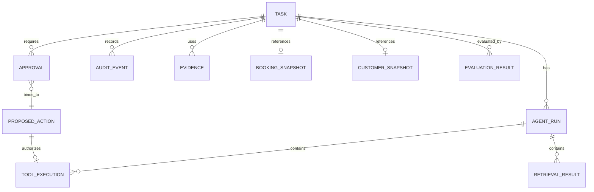
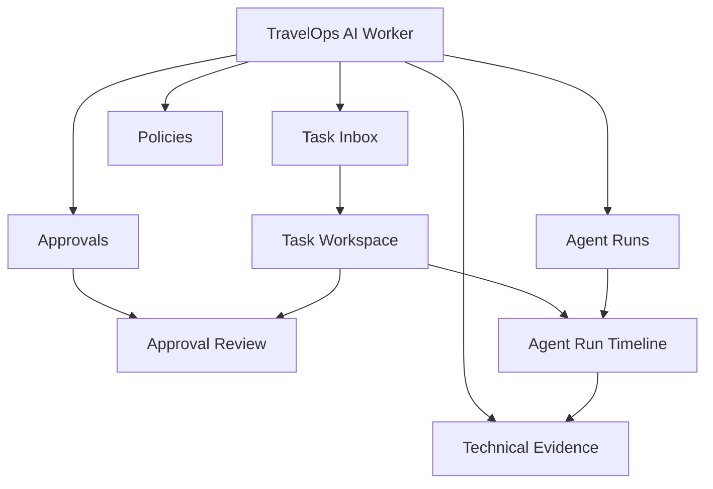
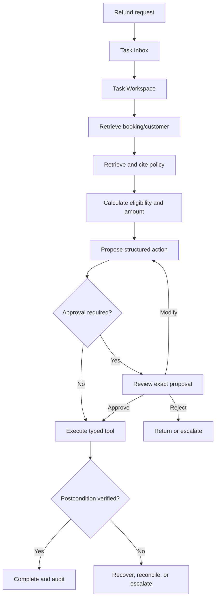
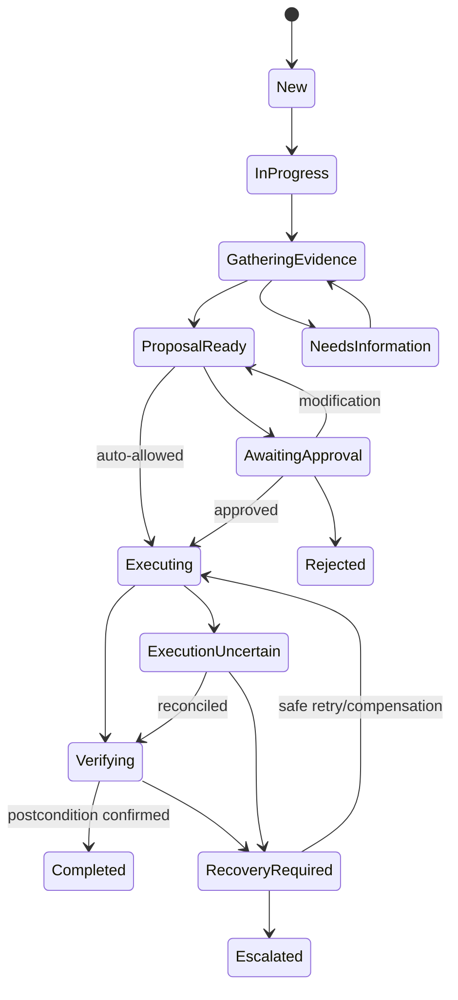
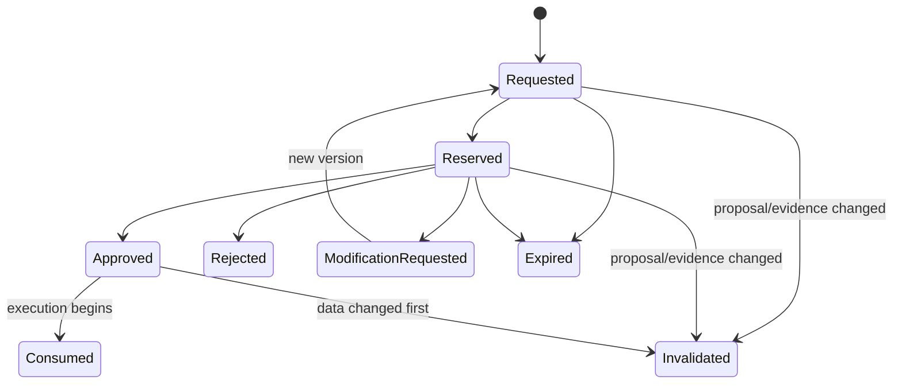

# TravelOps AI Worker — Product UX Architecture

**Purpose:** connect product intent, users, domain objects, workflows, and screen hierarchy before implementation.  
**Status:** normative product and UX architecture.

Companion documents:

- [Project Blueprint](../BLUEPRINT.md)
- [Enterprise Agentic Workflow UI/UX Design Bible](./ENTERPRISE_AGENTIC_WORKFLOW_UI_UX_DESIGN_BIBLE.md)
- [TravelOps UI/UX Blueprint](./TRAVELOPS_UI_UX_BLUEPRINT.md)

This document answers: **what are we building, for whom, around which objects, and through which controlled workflow?**

---

# 1. Five-minute product narrative

## What is it?

TravelOps AI Worker is an internal operations application for resolving travel-service requests such as refunds, ticket changes, cancellations, booking failures, and policy exceptions.

It is not a chatbot, autonomous travel agent, or general workflow builder. It gives an operator one durable work item, gathers booking and customer context, retrieves applicable policy evidence, proposes a bounded action, obtains human approval when required, executes through typed tools, verifies the external result, and preserves an audit trail.

## Who uses it?

Travel operations employees resolve customer and booking exceptions. Supervisors review consequential actions. Administrators maintain operational access and policies. Technical auditors inspect system behavior and evaluation evidence.

The interface serves people performing repetitive, consequential work for hours—not developers experimenting with prompts.

## What problem does it solve?

Travel operations work is fragmented across queues, booking systems, policies, customer records, calculators, approval channels, and manual notes. Operators repeatedly reconstruct context. This creates slow handling, inconsistent decisions, risky execution, and weak auditability.

TravelOps reduces fragmentation while preserving human authority. AI accelerates classification, retrieval, and proposal generation; deterministic policy and human review control consequential actions.

## Canonical workflow

```text
Request enters Task Inbox
→ classify task
→ retrieve booking and customer context
→ retrieve and cite applicable policy
→ evaluate eligibility and risk
→ produce a structured proposed action
→ obtain approval when policy requires it
→ execute through a typed tool
→ verify the external postcondition
→ complete, recover, or escalate
→ retain audit and evaluation evidence
```

## Core philosophy

> Workflow before AI. Evidence before action. Human authority before consequential execution. Verification before success.

The model is replaceable. Task state, evidence, policy decisions, approvals, tool executions, and audit history are the product.

## Product boundaries

TravelOps does:

- manage durable travel-operation tasks;
- retrieve booking, customer, and policy evidence;
- generate bounded structured recommendations;
- enforce risk-based approval;
- execute typed adapters safely;
- expose operational and evaluation evidence.

TravelOps does not:

- provide consumer booking or general chat;
- replace every GDS, CRM, or airline platform;
- author arbitrary workflows visually;
- expose unrestricted browser, shell, or code tools;
- treat model confidence as correctness.

---

# 2. Users and authority

These are operational roles, not invented demographic personas. Behavioral claims require user research.

## Travel Operator

Resolves assigned tasks within SLA: scans queues, verifies context and policy, reviews proposals, executes permitted low-risk actions, requests information, and recovers or escalates failures.

Cannot bypass approval, edit immutable evidence, change organization policy, or access unrestricted technical payloads.

Primary screens: Task Inbox, Task Workspace, Agent Run Timeline.

## Supervisor / Approver

Reviews exact actions, amounts, policy basis, risk triggers, expected outcomes, stale data, and prior decisions. Can approve, reject, modify, or request information within authority.

Cannot approve stale proposals, act outside authority, or silently alter an action during approval.

Primary screens: Approvals queue, Approval Review, Task Workspace.

## Operations Administrator

Manages users, roles, queues, routing, policy documents, effective dates, authorized risk thresholds, and integration references.

Administrative access does not automatically grant approval authority and never permits historical record changes.

## Technical Auditor / Platform Engineer

Inspects traces, tool attempts, errors, evaluation results, failure scenarios, and release/model/policy versions. Technical access cannot bypass business controls or change operational decisions.

Primary screens: Agent Run Timeline and Technical Evidence.

## Authority matrix

| Capability | Operator | Supervisor | Admin | Technical auditor |
|---|---:|---:|---:|---:|
| View/claim scoped tasks | Yes | Yes | Configure routing | Read-only when authorized |
| Edit proposed action | Before approval | Through modify flow | No | No |
| Execute low-risk action | Policy-controlled | Yes | No | No |
| Approve high-risk action | No | Authority-controlled | Not by default | No |
| Manage policy/access | No | No | Yes | Read-only |
| View technical payloads | Limited | Limited | Limited | Redacted by policy |
| Change audit history | Never | Never | Never | Never |

Authorization also depends on task scope, action type, amount, geography, provider, and proposal version.

---

# 3. Canonical object model

Screens are projections of domain objects. Objects must not be invented merely to support visual components.



## Object definitions

### Task

Durable unit of work containing ID/type, request, status and reason, priority/SLA, queue/assignee, booking/customer references, monetary exposure, current proposal version, and terminal outcome. A task is not a chat thread.

### Booking Snapshot

Versioned booking facts used for a decision: itinerary, status, provider locator, fares/payment, disruption facts, and source time. Material changes make dependent proposals and approvals stale.

### Customer Snapshot

Versioned relevant customer facts such as identity reference, contact channel, service tier, and communication preferences. Sensitive fields follow role and redaction policy.

### Evidence

A source-backed fact: policy clause, booking/customer fact, API response, customer request, deterministic calculation, or prior event. It records source, version/effective date, observed time, excerpt/value, applicability, and provenance. Evidence is distinct from inference.

### Agent Run

One bounded classification, retrieval, calculation, or proposal execution. It records task/proposal version, steps, provider/model version, budget, result, failure category, and trace correlation. Latest does not automatically mean authoritative.

### Retrieval Result

Query, corpus version, candidates, selected evidence, conflicts, and missing coverage. Operators see selected evidence/conflicts; diagnostics belong in Technical Evidence.

### Proposed Action

Versioned intent containing action type, validated parameters, amount, evidence, risk decision, approval requirement, expected postcondition, and originating run. Editing parameters creates a new version.

### Approval

Attributable decision bound to one proposal and evidence version. It records decision, reviewer, authority, reason, reservation, timestamps, expiry, and invalidation. It is not a Boolean on Task.

### Tool Execution

Typed attempt/result containing tool version, input, idempotency key, approval reference, attempt, status, receipt, redacted output, error class, and postcondition.

### Audit Event

Append-only business event containing actor, type, target/version, timestamp, reason, and correlation. It drives the operator timeline; technical spans do not replace it.

### Evaluation Result

Versioned assessment tied to scenario/dataset, release/model/policy version, expected versus actual behavior, evaluator, scores, evidence, and pass/fail reason.

```text
Task
├── Request
├── Booking Snapshot
├── Customer Snapshot
├── Evidence[]
├── Agent Run[]
│   ├── Retrieval Result[]
│   └── Tool Execution[]
├── Proposed Action (versioned)
│   └── Approval[]
├── Audit Event[]
└── Evaluation Result[]
```

---

# 4. Information architecture



## Screen hierarchy

Approval and timeline are contextual branches, not arbitrary deeper steps.

```text
Level 0 — Application shell
├── Level 1 — Work queues and cross-task areas
│   ├── Task Inbox
│   ├── Approvals
│   ├── Agent Runs
│   ├── Technical Evidence
│   └── Policies
├── Level 2 — Task Workspace
└── Level 3 — Contextual action/inspection
    ├── Approval Review
    └── Agent Run Timeline
```

| Screen | Primary object | User question |
|---|---|---|
| Task Inbox | Task collection | What needs attention next? |
| Task Workspace | Task and proposal | What is the defensible resolution? |
| Approval Review | Approval and proposed action | Should this exact action be authorized? |
| Agent Run Timeline | Run and audit events | What happened, where, and why? |
| Technical Evidence | Evaluations and runs | Can behavior be proven and compared? |

Navigation invariants:

- task identity/status remain visible in contextual views;
- returning preserves queue filter, sort, selection, and position;
- deep links address the same authorized object state;
- Browser Back follows the user’s path;
- Technical Evidence is not the operator landing page;
- no chat destination exists in primary navigation.

---

# 5. Canonical UX flows

## Standard refund



## Task state model



Do not collapse `AwaitingApproval`, `Executing`, and `ExecutionUncertain` into “Pending.”

## Approval lifecycle



## Failure recovery

```text
Detect failure
→ classify it
→ determine whether a side effect may have occurred
→ preserve task/evidence state
→ show impact and permitted recovery
→ retry, reconcile, compensate, request information, or escalate
→ record every attempt
→ verify final postcondition
```

---

# 6. UX success measures

Metrics are hypotheses until measured with representative users and realistic tasks. Do not publish arbitrary targets as truth.

## Outcome and safety

| Measure | Definition |
|---|---|
| Defensible completion rate | Correct outcome with applicable evidence, approval, and verified postcondition |
| Unsafe action rate | Actions executed without valid policy, authority, or current proposal; target is zero in controlled tests |
| Unnecessary escalation rate | Cases escalated despite sufficient evidence and authority |
| Incorrect auto-action rate | Auto-actions later judged incorrect |
| Recovery success rate | Failures resolved without duplicate or incorrect side effects |

## Efficiency

- time to identify and claim the next task;
- time to locate decisive evidence;
- time to reach a defensible decision;
- time to understand failure and select correct recovery;
- valid task throughput, segmented by task mix and risk.

Speed is paired with correctness. A five-second approval is not success if the reviewer misses a policy conflict.

## Comprehension and interaction quality

- Can users state current status and waiting reason?
- Can they distinguish fact, rule result, and AI recommendation?
- Can they explain why approval is required and what the action will do?
- Can they identify whether a failed tool may have caused a side effect?
- Can they locate the applicable policy clause?
- Track wrong-task opens, filter recovery, stale-approval detection, duplicate attempts, and keyboard completion.

## Initial measurement protocol

1. Measure the current/manual workflow or low-fidelity baseline.
2. Record time, errors, evidence checks, escalations, and decision correctness.
3. Test TravelOps with the same scenarios.
4. Set numeric targets from baseline improvement and safety requirements.
5. Test novices and experienced operators separately.

Required scenarios: straightforward refund, approval threshold, missing booking data, policy conflict, stale approval, unknown tool outcome, safe retry, and postcondition failure.

---

# 7. Hard constraints

A deviation requires an explicit product/design decision with evidence.

## Never

- Never make chat the homepage or canonical record.
- Never allow more than one primary action per decision region.
- Never execute a consequential action without current required approval.
- Never hide required evidence behind technical disclosure.
- Never use model confidence as proof.
- Never expose private chain-of-thought; show a decision summary.
- Never show completion before postcondition verification.
- Never silently retry a potentially non-idempotent side effect.
- Never silently change provider/model/tool when materially relevant.
- Never collapse distinct workflow states into generic “Pending.”
- Never rely on color, icon, hover, drag, or position alone.
- Never use a modal for deep approval/evidence review.
- Never place raw prompts/tokens/provider settings in Task Workspace.
- Never make technical traces the operator timeline.
- Never permit normal UI to alter audit history.
- Never add a chart that cannot open its underlying evidence.

## Defaults, not arbitrary laws

- One primary sidebar; a second requires proven IA need.
- Five flagship screens; add one only when a state, section, tab, saved view, or sheet cannot solve the job.
- Two visible row tags before summarizing extras.
- One context rail in Task Workspace, collapsing at narrow widths.
- Confirm only consequential actions; reversible actions prefer undo.
- Cards represent bounded objects, not every section. There is no arbitrary six-card limit.

Every consequential action records actor, authority, target, exact parameters, amount, policy/risk basis, proposal/evidence version, idempotency strategy, expected postcondition, receipt/outcome, and audit correlation.

Every feature designs initial, loading, active, waiting, verified success, validation error, permission denial, recoverable failure, uncertain outcome, stale data, and terminal escalation/rejection states.

Do not add multi-agent orchestration, a visual builder, connector marketplace, generic dashboard, unrestricted computer use, or broad administration suite before the core refund workflow meets its acceptance and evaluation criteria.

---

# 8. Document decision order

1. **Product UX Architecture:** boundaries, roles, objects, flows, hierarchy, measures, constraints.
2. **Design Bible:** interaction reasoning and universal rules.
3. **UI/UX Blueprint:** current layouts, tokens, and component inventory.
4. **Implementation:** satisfies all three or records an approved deviation.

Domain and authority follow Product UX Architecture. Interaction behavior follows the Design Bible. Visual/token details follow the UI/UX Blueprint. Implementation convenience never silently overrides product behavior.

> TravelOps AI Worker is a task-centric case-work system. The operator owns the decision, the workflow owns durable state, evidence supports the recommendation, policy controls authority, tools perform bounded actions, and audit/evaluation prove the result.
